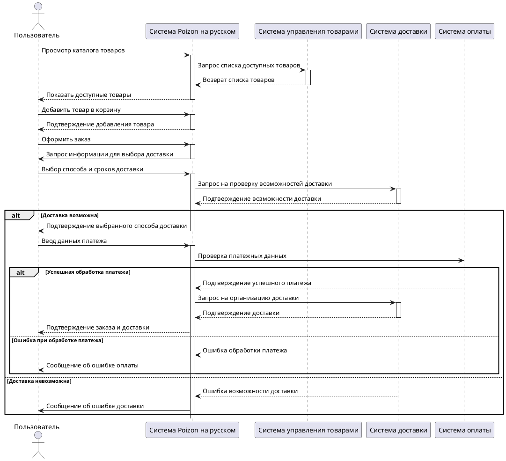
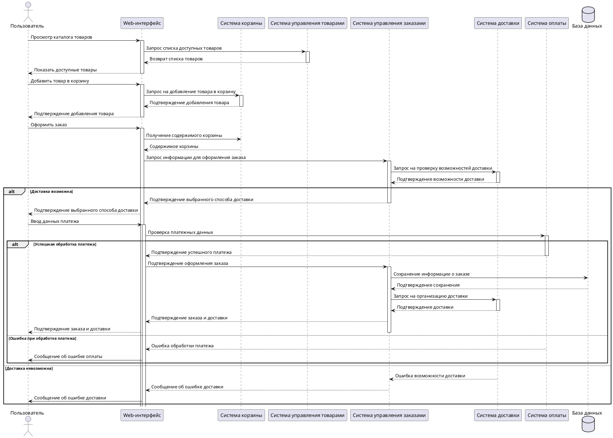

# Сценарии взаимодействия с системой

## Диаграмма 1: Основной сценарий взаимодействия

# Описание алгоритма

## Пользователь взаимодействует с системой:

1. Запрашивает каталог товаров.
2. Выбирает товар и добавляет его в корзину.

## Система Poizon выполняет:

1. Запрос данных из системы управления товарами.
2. Подтверждение добавления товара в корзину.
3. Проверку возможности доставки через систему доставки.
4. Обработку платежей через систему оплаты.

## Обработка сценариев:

- Если все данные корректны:
  - Пользователь получает подтверждение оформления заказа и доставки.
- В случае ошибок:
  - Пользователь уведомляется о проблемах с оплатой или доставкой.

---

# Детализированный сценарий оформления заказа

## Диаграмма

---

## Описание алгоритма

### Пользователь взаимодействует с веб-интерфейсом:

1. Просматривает каталог товаров.
2. Добавляет товары в корзину.
3. Оформляет заказ.

### Взаимодействие между системами:

1. Система корзины предоставляет данные о содержимом корзины.
2. Система управления заказами проверяет возможность доставки и обрабатывает запрос.
3. Система оплаты выполняет проверку и подтверждение платежей.

### Результат:

- **Успешный заказ**: данные сохраняются в базе, доставка организуется.
- **Ошибка**: пользователь получает уведомление о проблеме.

