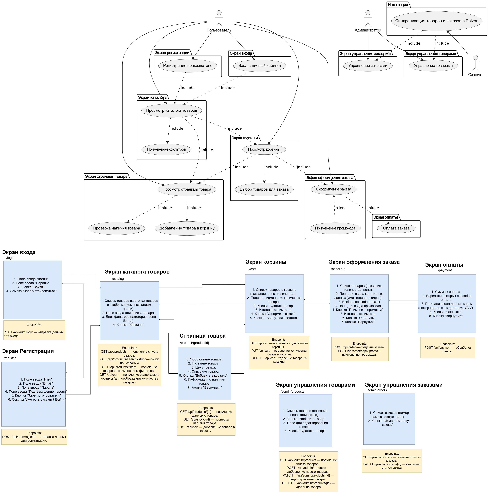

# Mockups

Mockups — это визуальные прототипы интерфейса, которые демонстрируют, как будет выглядеть система и взаимодействие пользователя с ней. Эти экраны помогают согласовать дизайн и логику системы между участниками проекта, прежде чем приступать к разработке.

---

## Список доступных Mockups:

### 1. **Экран входа**
- **Описание**: Этот экран используется для ввода учетных данных (логина и пароля) пользователя.
- **Ключевые элементы**:
  - Поля для ввода логина и пароля.
  - Кнопка "Войти".
  - Ссылка на восстановление пароля.
  - Перенаправление на экран регистрации.

---

### 2. **Экран регистрации**
- **Описание**: Экран для создания нового аккаунта.
- **Ключевые элементы**:
  - Поля для ввода имени, фамилии, email, телефона и пароля.
  - Кнопка "Зарегистрироваться".
  - Ссылка на экран входа для уже зарегистрированных пользователей.

---

### 3. **Экран каталога**
- **Описание**: Основной экран, где пользователи могут просматривать список доступных товаров.
- **Ключевые элементы**:
  - Карточки товаров с изображением, названием, ценой и кнопкой "Добавить в корзину".
  - Фильтры и поиск для выбора товаров по категории, бренду и цене.
  - Навигация между страницами каталога.

---

### 4. **Экран корзины**
- **Описание**: Экран, отображающий список товаров, которые пользователь добавил в корзину.
- **Ключевые элементы**:
  - Перечень товаров с количеством, ценой и возможностью удаления.
  - Поле для ввода промокода.
  - Итоговая стоимость.
  - Кнопка "Оформить заказ".

---

### 5. **Экран товара**
- **Описание**: Экран с детальной информацией о конкретном товаре.
- **Ключевые элементы**:
  - Изображение товара.
  - Название, описание, цена, наличие на складе.
  - Рейтинг товара и отзывы пользователей.
  - Кнопка "Добавить в корзину".

---

### 6. **Экран оформления заказа**
- **Описание**: Экран для заполнения данных доставки и подтверждения заказа.
- **Ключевые элементы**:
  - Поля для ввода адреса, выбора способа доставки.
  - Общая сумма заказа.
  - Кнопка "Перейти к оплате".

---

### 7. **Экран оплаты**
- **Описание**: Экран для завершения оплаты заказа.
- **Ключевые элементы**:
  - Выбор способа оплаты (карта, электронный кошелек, наложенный платеж).
  - Поля для ввода данных банковской карты.
  - Кнопка "Оплатить".

---

### 8. **Экраны управления товарами для администратора**
- **Описание**: Экран для администрирования каталога товаров.
- **Ключевые элементы**:
  - Таблица с товарами, включающая название, цену, количество на складе.
  - Кнопки для редактирования и удаления товаров.
  - Кнопка "Добавить товар" для добавления нового товара.

---

### 9. **Экраны управления заказами для администратора**
- **Описание**: Экран для управления заказами пользователей.
- **Ключевые элементы**:
  - Таблица с заказами, содержащая информацию о пользователе, статус заказа, сумму.
  - Возможность изменения статуса заказа (например, "В обработке", "Отправлен").
  - Полная информация о заказе (товары, адрес доставки, способ оплаты).

---

## Значение Mockups в проекте
Mockups позволяют заранее проанализировать и визуализировать все аспекты взаимодействия пользователя с системой. Они помогают:
1. Минимизировать риск недопонимания требований.
2. Упростить процесс разработки.
3. Создать интерфейс, который будет удобен и понятен пользователям.

Mockups для Ru.Poizon являются важным инструментом в процессе проектирования системы, позволяя своевременно вносить изменения в интерфейс и логику приложения.
